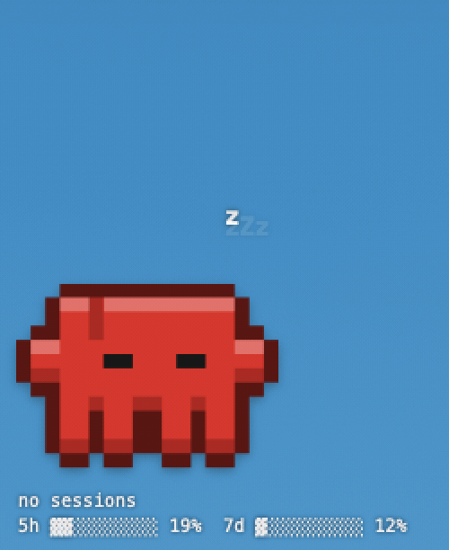

# Buddy — a Claude desktop pet for macOS

A little pixel buddy that floats on your desktop (no window, no card) and shows what Claude is
doing right now — across **Claude Code**, **Cowork** (cloud + local) and **claude.ai chats**.
Optional usage strip (5h / 7d windows) as a bar or a ticker.

<p align="center"></p>

Built with plain `swiftc` — no Xcode, no developer account, no 7-day signing expiry.

## What it shows

| State      | Source                                                                                   |
|------------|------------------------------------------------------------------------------------------|
| working    | Claude Code `PreToolUse` · Cowork `worker_status = running` · chat `live_status`          |
| thinking   | Claude Code between prompt and tool call                                                 |
| needs you  | permission prompt, idle prompt, Cowork `requires_action` / `blocked` (unread, < 2 h), chat `needs_input` |
| ready      | `Stop`, Cowork `review_ready` (unread, < 1 h)                                            |
| sleeping   | no sessions                                                                              |

Reactions: confetti + sound when something finishes, jumping `!` when Claude needs you, `x` eyes on
errors, hearts when you click it, breathing / blinking / the occasional wink while idle, arms that
wiggle while working. Drag it anywhere (position is remembered). Right-click or the paw icon in the
menu bar opens the menu.

Clicking a session in the menu opens it — Cowork sessions and chats in the Claude app (or in the
browser, configurable; hold ⌥ for the other one), local Claude Code sessions reveal their project
folder. Double-click the buddy to open whatever it is currently reacting to.

Extras: **wander mode** (Behavior menu) lets the buddy stroll along the edges of the screen — never
across it — with a proper walk cycle, pausing when Claude needs you or your cursor comes close.
And it plays **tic-tac-toe** (menu → 🎮): you are X, it thinks for a moment, gloats when it wins and
sulks when it loses. It plays well but not perfectly, so you can beat it.

## Look

- **Style:** pixel (filled, automatic outline + bevel — default) or ASCII (terminal look, 5×12 chars).
- **Species:** pixel: Clawd, Blob, Cat, Duck, Ghost, Robot, Penguin, Octopus, Rabbit · ASCII: 18 species.
- **Hat, eyes, color, size** (S/M/L/XL), card behind the buddy on/off, outline & shading on/off.
- **Language:** German or English (menu → Language); defaults to German on German systems, English elsewhere.
- Default species / hat / eyes are rolled deterministically from your account id ("Shuffle" in the menu).
- **Usage strip:** off · bar (5h/7d) · ticker (all windows with reset times + session summary).

## Data sources

1. **Claude Code hooks** (real-time, local): `hooks/buddy-hook.sh` appends every hook event as one JSON
   line to `~/Library/Application Support/Buddy/events.jsonl`; Buddy tails the file. Works for the
   terminal, IDE extensions and the Claude Code tab of the desktop app (cloud sessions don't read local hooks).
2. **Cowork / bridge sessions:** `GET https://api.anthropic.com/v1/code/sessions?exclude_tags=…` with the
   `sessionKey` cookie of the Claude desktop app (Keychain item "Claude Safe Storage" → decrypt the cookie
   DB, the same trick the [claude-usage-widget](https://github.com/Idefixart/claude-usage-widget) uses).
   Polled every 6 s.
3. **Chats:** `claude.ai/api/organizations/<org>/chat_conversations` (`needs_input`, `live_status`), every 20 s.
4. **Usage:** `claude.ai/api/organizations/<org>/usage` (`five_hour`, `seven_day`, …), every 60 s.

These cloud endpoints are internal and undocumented. If Anthropic changes them only the
Cowork/chat/usage parts stop working — the hooks keep going. Nothing leaves your machine except
those requests to claude.ai / api.anthropic.com with your own session cookie.

## Requirements

- macOS 14+ (release zips are Apple Silicon; Intel builds from source)
- Xcode Command Line Tools (`xcode-select --install`) — that's all, no Xcode
- Claude desktop app, logged in (for Cowork / chat / usage)
- Claude Code (for the hooks)

## Install

**Download:** grab `Buddy-<version>-arm64.zip` from [Releases](https://github.com/Mike-Hillebrand/claude-buddy-mac/releases),
unzip, move `Buddy.app` to `/Applications`. The build is ad-hoc signed (no Apple developer account),
so Gatekeeper will refuse it once. Clear the quarantine flag and it runs:

```sh
xattr -dr com.apple.quarantine /Applications/Buddy.app
open /Applications/Buddy.app
```

**Or build it yourself** (Command Line Tools are enough):

```sh
./build.sh            # → build/Buddy.app
./build.sh install    # build, copy to /Applications, (re)launch
./build.sh release    # build + zip for a release
```

"Launch at login" is in the menu (SMAppService).

## Hooks

Menu → **Behavior → Install Claude Code hooks…**, or manually:

```sh
python3 hooks/install-hooks.py             # merges into ~/.claude/settings.json (backup: settings.json.buddy-backup)
python3 hooks/install-hooks.py --uninstall
```

The hooks are `async` and add no latency to Claude Code. Running sessions pick them up after a restart.

## Project layout

```
Sources/Core/   sprites (ASCII + pixel, hats, eyes, speech bubble), localization + state model — Foundation only, tested
Sources/App/    AppKit/SwiftUI: panel, view, menu, hook watcher, API client, settings
Resources/      app icon (rendered from the Clawd sprite; .icns is generated at build time)
hooks/          buddy-hook.sh, install-hooks.py
tools/          demo.sh (records the feature demo via `Buddy --demo`), uiclick.swift (synthetic clicks), screens.swift
Tests/          CoreTests.swift (also runs on Linux Swift)
```

Core tests: copy `Tests/CoreTests.swift` to `main.swift`, then
`swiftc -swift-version 5 Sources/Core/*.swift main.swift -o /tmp/t && /tmp/t`.

## Demo mode

`Buddy --demo` reads commands from `~/Library/Application Support/Buddy/cmd.txt` (one per line:
`state working Edit`, `species cat`, `hat crown`, `theme lime`, `usage ticker`, `wander 1 -1`,
`walk-now 14`, `game`, `move 4`, `menu`, `pet`, `quip <text>`, …) and ignores real hook events, so a
script can walk it through every feature for a recording — see `tools/demo.sh`. Other flags:
`--no-greeting`, `--game`, `--walk-now`, `--wander-dir=-1`.

## Drawing your own pixel species

`Sources/Core/PixelSprites.swift`: 16×14 grid, 2–3 frames. Legend: `.` empty, `#` body, `s` shade,
`l` light, `w` white, `d` dark, `a` accent (yellow), `e` eye slot (2×2 or 2×3). Outline and bevel
are added automatically.

## Authors

[Mike Hillebrand](https://github.com/Mike-Hillebrand) · [Mike Hillebrand Media](https://github.com/MikeHillebrandMedia) — built together with Claude.

## Notes

Not affiliated with Anthropic; the sprites are original pixel art.

## License

MIT — see [LICENSE](LICENSE).
